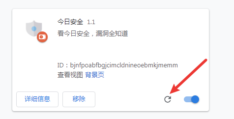
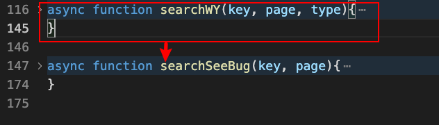
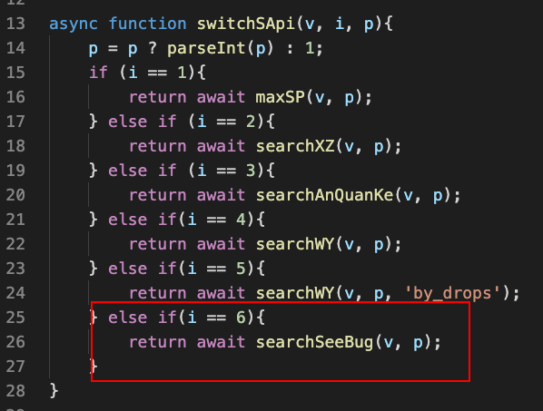
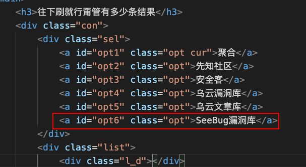
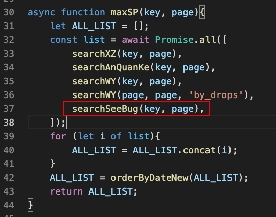

# SAI（Securely aggregate information）
一个Chrome插件，用于每天关注知名安全网站文章
了解到对于有安全兴趣或者从事安全行业的人来说，如果不去时常关注知名的安全内容网站，那就像是**闭门造车**，没法了解到整个安全行业的最新情况。这个初心造就了这个插件，希望**它能帮到你**。

## 让我们开始吧

克隆到本地

`git clone https://github.com/linjiananallnt/SAI.git`

然后直接将整个文件夹拖放安装

安装之后就可以愉快的使用啦     ~~不会有人不懂操作吧~~

### 如果有更新

先进入 SAI 的文件夹再执行更新命令

`git pull`

然后回到 Chrome 的 chrome://extensions/

找到该插件然后更新

### 使用方法简单看

挑选喜欢的网站阅读

直接滑没有分页可言

聚合搜索让你更快找到漏洞

# 更新日志

我觉得我只是站在巨人的肩膀上做了一件小小的事情，所以决定将源码贡献给大家。大能可以自行修改插件代码来做到真正按照自己喜欢的方式去使用。

*因为工作和学习，我不确定什么时候更新，所以...欢迎 star*

## 更新内容 （2021/02/06）

版本号：v1.1

- 增加搜索接口
  - 乌云漏洞库
  - 乌云文档
  - seebug漏洞库
- 增加数据获取接口
  - freebuf
  - freebuf 漏洞快讯
  - seebug
- 修改了搜索内容跳转方式
- 增加记忆用户选择
- 优化JS代码
- 增加 loading
- 增加了更多
- 增加用户交互动画 ~~网页上哪里都可以摸一下哦~~
- 添加GitHub跳转链接
- 增加点击式翻页

## 更新内容 （2021/02/05）

版本号：v1.0

- 增加搜索接口
  - 先知社区
  - 安全客
- 增加数据获取接口
  - 先知社区
  - 安全客
- 增加下拉式翻页

# 自定义接口

插件的接口都是使用 fetch 去请求然后 js 爬取页面，再将数据转成页面需要的数据结构（结构可以去全局搜索 generate 命名的函数看）。有两个 api 文件来支持该插件的运行：

- data_api.js
- search_api.js

如果需要自定义接口可以直接从文件中复制相同的函数修改即可。这里给出**制作搜索接口**的流程。

#### 一、制作好接口

请求统一采用异步 Promise。编写 search_api.js 时直接复制上一个接口来编写。

#### 二、增加到选项

相当于入口函数，添加到里面才能通过上层使用你定义好的接口

#### 三、页面上添加按钮

当然离不开页面的交互，复制粘贴好后修改 **名字** 和对应的 **ID** 即可

#### 四、“聚合”

如果你希望你的接口能在聚合一起出现可以这样做。编写 search_api.js 中的 maxSP 函数

# 最后

虽然是一个小插件，但是其中运用到了很多 JS 的设计模式。代码的复用封装花费了我很多的时间，但是它任然是不完美，如果可以希望与那么有智慧的你一起探讨知识。